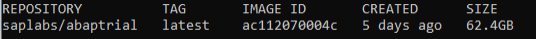
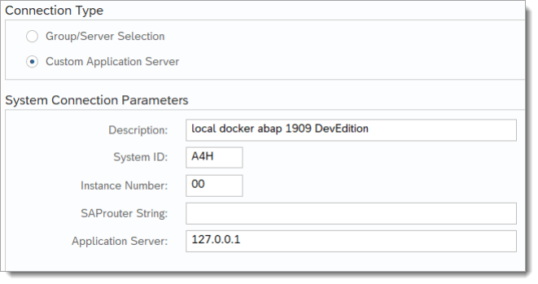
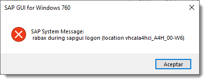
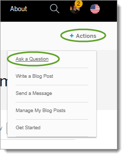

# ABAP Trial Platform 1909 on Docker: Tips and Tricks

- [1 Getting Started](#1-getting-started)
  * [Hardware requirements:](#hardware-requirements-)
  * [Linux](#linux)
  * [Installation](#installation-and-starting)
  * [Starting / stopping / restarting](#starting---stopping---restarting)
    * [Starting:](#starting-)
    * [Shutting down gracefully](#shutting-down-gracefully)
    * [Restarting](#restarting)
  * [Other relevant Docker commands](#other-relevant-docker-commands)
- [2 Licenses](#2-licenses)
- [3 Working with the ABAP developer edition](#3-working-with-the-abap-developer-edition)
- [4 Errors](#4-errors)
- [5 Users and Passwords](#5-users-and-passwords)
- [6 Resources](#6-resources)
  * [Troubleshooting Resources](#troubleshooting-resources)

<small><i><a href='http://ecotrust-canada.github.io/markdown-toc/'>Table of contents generated with markdown-toc</a></i></small>


# 1 Getting Started

## Hardware requirements:

## Linux

-   4 CPUs

-   16GB RAM

-   150GB Disk

> **Windows**

-   4 CPUs for Docker Desktop

-   16GB for Docker Desktop

-   170GB disk for Docker Desktop

> **macOS**

-   4 CPUs for Docker Desktop

-   16GB for Docker Desktop

-   170GB disk for Docker Desktop

## Installation

1.  Create a [Docker account](https://hub.docker.com/_/sap-abap-trial/plans/ac8a4f9b-ae29-4afa-9b39-25aeea24b821?tab=instructions).

2.  Download Docker [Download Docker Desktop (Windows/Mac/Linux)](https://www.docker.com/products/docker-desktop)

3.  Make sure Docker Engine is running:

    ```
    docker info
    ```
      -   returns detailed info about docker if docker is running

4.  Login to Docker

    ```
    docker login --username=\<yourhubusername\>
    --mail=\<youremail@company.com\>
    ```

5.  Pull the image ABAP Platform 1909 DevEdition to your local PC

    ```
    docker pull store/saplabs/abaptrial:1909
    ```

      This can take a few hours.

6.  Check that the pull was successful

    ```
    docker images
    ```
      -   returns the list of locally available images

>  style="width:5.58264in;height:0.4062in" />

## Starting / stopping / restarting

### Starting:

Create a container and start the ABAP system:

**GNU/Linux**

```
docker run --stop-timeout 3600 -it --name a4h -h vhcala4hci
store/saplabs/abaptrial: latest -agree-to-sap-license -skip-limits-check
```

**Other OS:**

```
docker run --stop-timeout 3600 -i --name a4h -h vhcala4hci -p 3200:3200
-p 3300:3300 -p 8443:8443 -p 30213:30213 -p 50000:50000 -p 50001:50001
saplabs/abaptrial:latest -agree-to-sap-license -skip-limits-check
```

Notes:

- -i = start the container in interactive mode, so that later we can stop
the system gracefully using Ctrl-C.

- --stop-timeout = Docker will give HDB enough time to write its InMemory
database onto disk upon shutdown request.

- We name the container *a4h* for easier reference in future commands.

- If you want to use **[podman](https://podman.io/)** instead of docker,
please add also the parameter *-t* to correctly forward SIGINT to the
container's init process.

- After all the services are successfully started, it is a good idea to
wait until CPU load goes down and amount of used of memory stops from
growing before you attempt to logon to the system.

For more information, see the [Setup
Instructions](https://hub.docker.com/_/sap-abap-trial/plans/ac8a4f9b-ae29-4afa-9b39-25aeea24b821?tab=instructions)

The image comes with a SAP Hana license applied.

You need to apply an SAP Demo License, available as a zip file here:  
[SAP License Keys for Preview, Evaluation and Developer Versions
("minisap")](https://go.support.sap.com/minisap/#/minisap)

Or here:

[SAP Trials and Downloads: ABAP Platform 1909 Developer Edition on SAP
HANA 2.0](https://developers.sap.com/trials-downloads.html?search=ABAP+Platform+1909+Developer+Edition+on+SAP+HANA+2.0)

### Shutting down gracefully

**Important: Make sure you stop the container in a controlled manner:**

```
docker stop --time-out 7200 a4h
```

**Otherwise the container becomes unusable and all changes are lost. You
would then need to create a new one.**

### Restarting

```
docker start -ai a4h
```

## Other relevant Docker commands
```
docker exec -it a4h bash
```
- Create terminal within the docker image / container (equivalent to PuTTy)

```
docker images
```
- Returns list of all available images

```
docker inspect
```
– Returns detailed information, e.g. IP address of container

```
docker ps -a
```

– Returns list of containers, including stopped containers

For more information on docker commands, see [docker docs: Command-line
Reference](https://docs.docker.com/engine/reference/run/)

## Set up SAP Gui and logon to the system ABAP Platform 1909

1.  Install the SAPGui that fits to your operating system, attached
    here.

2.  Set up System access (example SAP GUI 760 for Windows)

    1.  Click on New, select Connection

    2.  Select user specific system:



3.  Logon to the system


> Client: 001
>
> User: developer
>
> Password: Ldtf5432
>
> Language: EN


Password for the a4hadm OS user in the container:

In Docker you don't need a password for user **a4hadm**. You just open a
new CMD prompt and switch users:

```
docker exec -it a4h bash  
su a4hadm
```
## Getting started: MacBook

Community member [Dylan Drummond](https://people.sap.com/murmelssonic)
has written an excellent guide to installing **ABAP Platform 1909
Developer Edition** on a MacBook:

[Install Abap Platform Developer Edition on Docker for
MacBook](https://blogs.sap.com/2021/05/31/install-abap-platform-developer-edition-on-docker-for-macbook/)

## Getting started: Podman

If you want to use [podman](https://podman.io/) instead of docker,
please add also the parameter *-t* to the docker run command to
correctly forward SIGINT to the container's init process.

# 2 Licenses

The image comes with a SAP Hana license applied.

You need to apply an SAP Demo License, available as a zip file here:  
[SAP License Keys for Preview, Evaluation and Developer Versions ie "minisap"](https://go.support.sap.com/minisap/#/minisap)

Or here:

[SAP Trials and Downloads: ABAP Platform 1909 Developer Edition on SAP HANA 2.0](https://developers.sap.com/trials-downloads.html?search=ABAP+Platform+1909+Developer+Edition+on+SAP+HANA+2.0)

## Error in license Keys
e.g. "Logon not possible (error in license check). "
See section 4 Errors -> Logon not possible (error in license check)

## Deleting and installing the license using bash
1.	Start a4h and copy the hardware key

    ```
    docker start -ai a4h
    ```

2.	Generate key in the following link with the hardware key. https://go.support.sap.com/minisap/#/minisap

3.	Rename the file `A4H_Multiple.txt` to `A4H.txt`
4.	Copy the license
    ```
    docker cp A4H.txt a4h:/opt/sap/ASABAP_license
    ```
5.	Run the following command and the license will be activated

    ```
    docker start -ai a4h
    ```

6.	You can check the license with the `SLICENSE` transaction.

*Sources:
- [How to install a new license, Comment 590445](https://blogs.sap.com/2021/04/22/how-to-install-a-new-license-in-your-sap-abap-platform-developer-edition/comment-page-1/#comment-590445)
([RICARDO COYLLO MAYTA](https://people.sap.com/rcdesarrollo), September 24, 2021 at 5:40 pm)

- [Setup Instructions](https://hub.docker.com/_/sap-abap-trial/plans/ac8a4f9b-ae29-4afa-9b39-25aeea24b821?tab=instructions)

## Shutting down gracefully

Have a look at the section on licenses in the [Setup
Instructions](https://hub.docker.com/_/sap-abap-trial/plans/ac8a4f9b-ae29-4afa-9b39-25aeea24b821?tab=instructions).

You can apply new licenses every time you create a new one or start an
existing container.

If you get an error, [Gregor Wolf](https://people.sap.com/gregorw) has helpfully provided a guide to updating the ABAP and HANA licenses:
[Update ABAP and HANA License for the ABAP Platform, Developer Edition for Docker](https://blogs.sap.com/2022/08/12/update-abap-and-hana-license-for-the-abap-platform-developer-edition-for-docker/)

# 3 Working with the ABAP developer edition

## Day 1 Experience and Tips and Tricks

[Thomas Jung](https://people.sap.com/thomas.jung) shares his
“experiences installing the new ABAP developer edition on my Windows
laptop. I run Docker on WSL2. Plus some general tips and commands that I
found helpful along the way.”

## Enhancing your Developer Edition – Community Blog Post

“…Interesting things how you can either enhance, tune, make more
advanced and similar sort of things to your SAP NetWeaver Application
Server ABAP Developer edition” – interesting collection by Martin
Marushkin (Twitter: [MartinMar](https://twitter.com/softy012)), some
basic, some quite advanced. Just one small point: In 1909, abapGit is
automatically installed and SAP Flight Reference Scenario automatically
pre-delivered , so no need to repeat sections 4 and 5:

[Power up your SAP NetWeaver Application Server ABAP Developer
edition](https://blog.maruskin.eu/2019/11/power-up-your-sap-netweaver-application.html)

## ABAP Database Managed Procedures (AMDP) + SAP BW
Yes, this works.

However, if you want to use AMDPs in conjunction with SAP BW, you need
to apply the correct SAP Notes. **That is, you must be a customer or
partner.**

*Source: <https://twitter.com/pawelwiejkut/status/1383495200547377153>*

## abapGIT, Can I use?
YES.
Briefly, abapGIT is a GIT client written in ABAP for ABAP. It offers an easy way for developers to upload their ABAP development objects to / import others’ interesting development objects to an openly available Git site. And it really is easy.
Follow this blog for a great, end-to-end guide to installing the tool and cloning a sample package into your developer edition: https://blogs.sap.com/2017/06/21/abapgit-so-easy/ (GrahamRobbo)
UPDATE: abapGit is now available for ABAP Development Tools (i.e. Eclipse): http://eclipse.abapgit.org/updatesite/
There is a useful collection of projects here:
•	http://dotabap.org/
•	https://github.com/SAP-samples


## Language support, Adding to SAP ABAP Platform 1909

See this blog post for more information: *Source:
<https://blogs.sap.com/2021/02/24/adding-languages-to-sap-abap-platform-1909-developer-edition-for-multilingual-development>*

## Persistence: How is the data in the ABAP container persisted?

The data is persisted in the Docker scratch space. For more information,
see : [docker scratch
space](https://docs.docker.com/get-started/05_persisting_data/)

## Podman, can I use instead of Docker?

Yes. If you want to use [podman](https://podman.io/) instead of docker,
please add also the parameter *-t* to the docker run command to
correctly forward SIGINT to the container's init process.

## SAP Business / SAP S/4HANA content – eg. FB01, MM03, VA01

We do not include business transactions in the developer edition,
because it is purely intended for learning ABAP syntax and tools.

If you want to play around with business content:

1.  If you just want some example tables / DDIC objects / dev objects to
    practise on, you can use the EPM model in S_NWDEMO , eg Purchase
    Order DDIC objects inS_NWDEMO_MODEL_DDIC, eg SNWD_PO.

2.  To access a fully-activated S/4HANA (1809 or 2009) appliance: [SAP
    S/4HANA Fully-Activated Appliance: Create your SAP S/4HANA system in
    a fraction of the usual setup
    time](https://blogs.sap.com/2018/12/12/sap-s4hana-fully-activated-appliance-create-your-sap-s4hana-1809-system-in-a-fraction-of-the-usual-setup-time/)

3.  For SAP Customers and Partners, we also offer IDES Systems: [799639
    – IDES – General Information about the usage of IDES
    systems](https://launchpad.support.sap.com/#/notes/799639)

## SAP Fiori launchpad, connect to:

You must edit the Hosts file – on local machine, not inside Docker

*Source:
<https://answers.sap.com/questions/13296560/abap-trial-sap-abap-platform-1909-start-fiori-laun.html>*## SAP HANA Studio

You can install the HANA tools as Eclipse plugin
-\> <https://tools.hana.ondemand.com/#hanatools>

## SAP GUI for Java ("JavaGUI"), connect to:
Ignore the System, Logon, Security, Language tabs. Go to Advanced tab > Expert Mode > enter IP address OR mapped DNS name of VM of your SAP System + SAP instance number (default = 00).
e.g. NPL system, on VM on host 192.168.64.11, main instance = 00, hence SAPGUI port = 3200 => Connection string = 

**`conn=/H/192.168.64.11/S/3200`**

Depending on the Hypervisor you use, you may need to set up port forwarding from local machine port 3200 (say) to the VM port 3200.
*(From: https://blogs.sap.com/2019/10/01/as-abap-7.52-sp04-developer-edition-concise-installation-guide/comment-page-1/#comment-625449 )


## SAP HANA database - via external tools, e.g. SAP HANA Studio, DBeaver, WebIDE

### Solution 1, connect to:

If you want to connect to HANA via external tools like HANA Studio oder
DBeaver, you have to publish the ports 30213 and 30215 in the docker run
command.

Same with WebIDE:

```
-p 8080:8080 or -p 53075:53075
```

*Source:
<https://blogs.sap.com/2021/02/15/sap-abap-platform-1909-developer-edition-available-soon/comment-page-1/#comment-558716>*

### Solution 2: Troubleshooting

“I ran into problem with tenant connection from Hana Studio, and it was
resolved with [SAP Note 2551889](https://launchpad.support.sap.com/#/notes/2551889)”

*Source:
<https://blogs.sap.com/2021/02/15/sap-abap-platform-1909-developer-edition-available-soon/comment-page-1/#comment-560001>*

## SAP HANA, Using Multi Model Capabilities of

Great three-part blog series by Uwe Fetzer on:

-   [Part I: Document Store aka NoSQL
    database](https://blogs.sap.com/2021/02/16/using-multi-model-capabilities-of-sap-hana-in-the-new-abap-1909-developer-edition-part-i-document-store/)

-   [Part II: Spatial
    functions](https://blogs.sap.com/2021/02/16/using-multi-model-capabilities-of-sap-hana-in-the-new-abap-1909-developer-edition-part-ii-spatial-functions/)

-   [Part III: Graph
    functions](https://blogs.sap.com/2021/02/18/using-multi-model-capabilities-of-sap-hana-in-the-new-abap-1909-developer-edition-part-iii-graph-functions/)

## SAP Screen Personas, using developer edition with

Note: SAP Customers and Partners only.

Steve Rumsby has written an excellent blog post on how to set this up:

[SAP Screen Personas on the ABAP developer edition
system](https://blogs.sap.com/2021/03/22/sap-screen-personas-on-the-abap-developer-edition/)

## SSL certificate, Secure your SAP ABAP System with

Video by Jakub Marius Kjaer:

<https://www.youtube.com/watch?v=k9ET6clRjG8>

## WinSCP or equivalent
1.	Easiest: **Before running container**: Share a common folder between the docker image and the host using the `-v` flag in the `docker run`.

2. Start a web server on you host PC (for example with `Xampp`) and `CURL` the files from the docker image.

## Wireshark with SAP Dissectors for Ubuntu and macOS
[Wireshark with SAP Dissectors for Ubuntu and macOS](https://blogs.sap.com/2022/06/12/wireshark-with-sap-dissectors-for-ubuntu-and-macos/)
By Dylan Drummond

# 4 Errors

## Azure Container Instance, error trying to connect with

**UPDATE, 2<sup>nd</sup> March, 2021**

**“**The maximum size for a deployable container image on Azure
Container Instances is 15 GB;  You might be able to deploy larger images
depending on the exact availability at the moment you deploy, but this
is not guaranteed.

<https://docs.microsoft.com/en-us/azure/container-instances/container-instances-faq#how-large-can-my-container-image-be>
“

*Source:
<https://answers.sap.com/questions/13291704/deploy-abap-platform-developer-edition-1909-docker.html?childToView=13295341#comment-13295341>*

## SAP Business Warehouse + AMDP: Errors

<https://twitter.com/pawelwiejkut/status/1383495200547377153> - only for
SAP BW users using AMDPs

## SAP GUI, error starting



1.  System hasn’t warmed up

2.  Hosts file

3.  Resources

4.  Check ST22 (“Rabax”)

You can eliminate the popup and get the rabax directly by:

Eliminate the "rabax during sapgui logon" popup and display the dump
(recommended):

1.  Set profile parameter "login/quiet_mode" to 0.

2.  Restart the system so that profile parameter changes take effect.

3.  Reproduce the issue (logon to the system).

4.  The popup "rabax during sapgui logon" should disappear now and
    you are able to:see the dump directly.

Taken from SAP Note 429578 - How to deal with error "rabax during sapgui
logon

*Source:
<https://blogs.sap.com/2021/02/15/sap-abap-platform-1909-developer-edition-available-soon/comment-page-1/#comment-558556>*

## License check, error in
Cause: The Linux OS, e.g. SLES has the wrong date.
Solution: Check the date and time of the server at OS level, in order to verify that it’s correct.

That is, executecommand “date” (without quotes) **in Linux** (not Windows).

The SAP system receives the time and the date from the OS. Therefore, you need to stop the system, adjust the correct system's date/time on OS level and re-start the system.

If you are an SAP customer or partner, see [SAP Note 2164980](https://launchpad.support.sap.com/#/notes/0002164980) for details.

## Slow start in Docker Desktop, Mac / Windows
The issue is that Docker Desktop uses a fixed amount of memory as defined in the resource config. If I want to run A4H on my MacBook then I set it to 20GB, and that's what Docker Desktop will consume on startup - even if I just want to run a tiny Kroki or Gitea system. Therefore starting up a 16GB+ Docker Desktop takes a little while if you want to run A4H on non-Linux hosts. 

Secondly, A4H startup gets to a login-able state in a couple of minutes but then spends a good 10 minutes or so exercising the CPU fan by "doing stuff" (on Linux too) until it settles down. It's not really useable during this time so I consider this startup time.

After a total of 20 minutes it's fast. Once it's settled in, I can run both A4H and 7.52 on VMware simultaneously on my 32GB MacBook without a problem, I can even start Windows VM too if I need it.
[Comment by Mike Pokraka](https://blogs.sap.com/2021/02/15/sap-abap-platform-1909-developer-edition-available-soon/comment-page-2/#comment-623886)

## Slowing down, developer edition is

“Lately, I find that I have had to compress my VM Drive to keep the
system from slowing down” or similar.

This answer includes SAP Community content, so use it at your own risk.

“There are several utility programs available, for example:

Application Log: Delete logs in SAP (SLG2).

You can also Display logs in SAP (SLG1).

More information here:

[SLG2 SAP tcode - Application Log: Delete
logs](https://www.se80.co.uk/saptcodes/s/slg2/slg2.htm)

Also: Delete ST22 dumps by running RSSNAPDL.

More information here:

[RSSNAPDL SAP ABAP Report - Reorganization Program for Table SNAP of
Short Dumps](https://www.se80.co.uk/sapreports/r/rssn/rssnapdl.htm)”

*Source:
<https://blogs.sap.com/2021/02/15/sap-abap-platform-1909-developer-edition-available-soon/>
Search: SLG2*

See also: [Power up your SAP NetWeaver Application Server ABAP Developer
edition](https://blog.maruskin.eu/2019/11/power-up-your-sap-netweaver-application.html),
sections 2, 3, 8, 9

# 5 Users and Passwords

**Normal user/password:**

> User: developer
>
> Password: Ldtf5432

**Password for the a4hadm OS user in the container**

In Docker you don't need a password for user **a4hadm**. You just open a
new CMD prompt and switch users.

docker exec -it a4h bash  
su a4hadm

# 6 Resources

[Setup Instructions](https://hub.docker.com/_/sap-abap-trial/plans/ac8a4f9b-ae29-4afa-9b39-25aeea24b821?tab=instructions)

## Troubleshooting Resources

For troubleshooting, ask your question in the ABAP Development Community
forum:

<https://www.sap.com/community/topic/abap/all-content.html>



If it is an issue involving ABAP developer edition, remember to add the
hashtag **\#ABAP_Trial**.

Please do **not** use comments in the blogs to ask tech support
questions:

-   It makes it difficult for other users to find similar issues in
    future, which leads to many duplicated errors.

-   Very few people follow these blogs, so you will not get help from
    the vast majority of the community

-   There is no capacity to monitor all blogs for all released versions.

.
